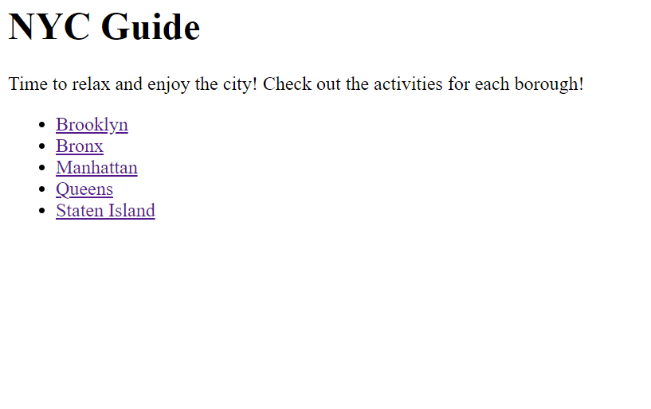

# Guide-to-NYC

## Description


- This NYC Guid will help you browse different boroughs and their respective activites
- Created using Python, Django as the backend, basic HTML was used for the front end
- The project is a work in progress. Further improvements can be made to the user view
- Feel free to clone or fork this repo and make it your own or use it for learning purposes
- Installation instructions are listed below


## Installation

- You will need Python 3.10.x or above; You can download it [here](https://www.python.org/)
- Clone the repo using HTTPS:
```
git clone https://github.com/mejia-b/Guide-to-NYC.git
```
- Clone the repo using SSH:
```
git clone git@github.com:mejia-b/Guide-to-NYC.git
```

- Once cloned, create a virtual environment:
```
Windows: python -m venv <nameofvirtualenvironment>

To activate run the following commands:
cd <nameofvirtualenvironment>/Scripts
activate
```

```
Mac/Linux: python3 -m venv <nameofvirtualenvironment>

To activate run: source <nameofvirtualenvironemnt>/bin/activate
```

- Install packages from requirements.txt
```
pip install requirements.txt
```

## Usage

To view the guide on your local machine go ahead and navigate to the directory where manage.py is located.
Once there run the following command:
```
On Windows:
python manage.py runserver

On Mac/Linux:
python3 manage.py runserver

This should spin up the server and you should see a link where you can view the NYC Guide. Enjoy!
```




    "# Guide-to-nyc" 
